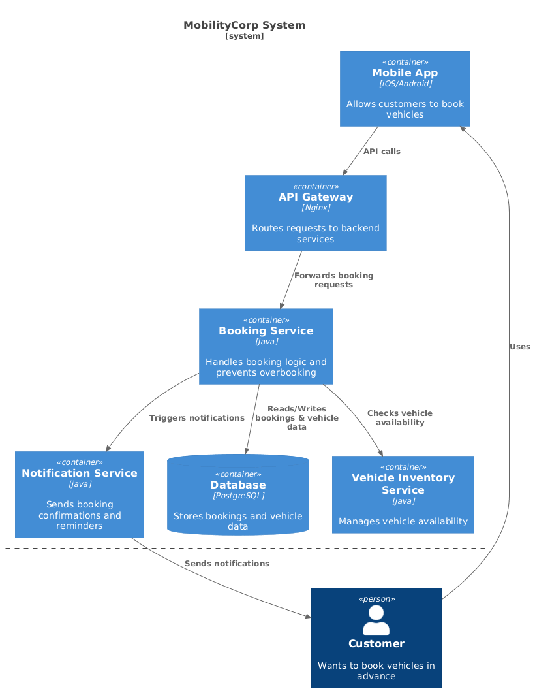
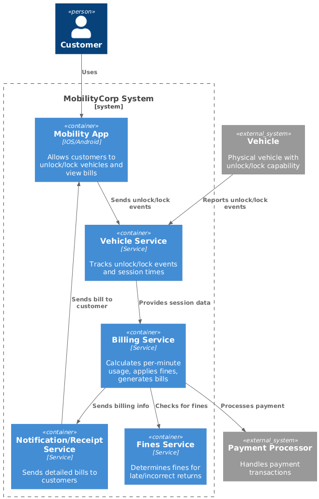

# kata-MobilityCorp

## Introduction
MobilityCorp is a vehicle rental management system that enables customers to rent electric scooters, eBikes, electric cars, and vans for short-term transportation needs. The system manages vehicle availability, bookings, payments, returns, maintenance operations, and predictive analytics to optimize vehicle utilization.

## Requirements

### Functional Requirements

1. **Vehicle Booking**
	- As a customer, I want to book vehicles in advance so that I can ensure transportation is available when I need it.
		- Acceptance Criteria:
			- Cars and vans can be booked up to 7 days in advance for a specific duration.
			- Bikes and scooters can be booked up to 30 minutes in advance, with open-ended bookings (up to 12 hours maximum).
			- The system prevents overbooking.
			- Booking confirmations and reminders are sent via app notification.

2. **Vehicle Access via Smartphone**
	- As a customer, I want to unlock and lock vehicles using my NFC-capable smartphone app (iOS/Android) so that I can access my rental conveniently.
		- Acceptance Criteria:
			- The app supports NFC unlocking for all vehicle types.
			- Access is granted only during the active booking period.
			- The system logs all unlock/lock events.
			- Cars and vans can be remotely disabled if needed.

3. **Per-Minute Billing and Fines**
	- As a customer, I want to pay per minute of usage so that I only pay for the time I actually use the vehicle.
		- Acceptance Criteria:
			- Usage time is calculated from unlock to lock.
			- Billing increments: 1 minute.
			- Payment is processed automatically at the end of the session.
			- Fines are applied for vehicles returned late or to the wrong location.
			- Customers receive a detailed bill.

4. **Real-Time Vehicle Tracking**
	- As MobilityCorp, I want to track all vehicles in real time and control access so that I can monitor fleet status and location and ensure security.
		- Acceptance Criteria:
			- All vehicles have GPS trackers; location is updated continuously.
			- The fleet dashboard displays live status and last known location.

5. **Waitlist & Notification for Unavailable Vehicles**
	- As a customer, I want to register my booking requirements if no vehicles are available so that I can be notified when one becomes available.
		- Acceptance Criteria:
			- Customers can join a waitlist for a specific time, location, or vehicle type.
			- The system notifies customers in order of registration when a vehicle becomes available.
			- The waitlist expires when the time slot passes or when a booking is made.

6. **Predictive Demand Analytics**
	- As MobilityCorp, I want to predict vehicle demand patterns so that I can position vehicles where customers need them.
		- Acceptance Criteria:
			- The system generates daily demand forecasts by location and vehicle type.
			- Fleet repositioning recommendations are provided to staff.
			- Forecast accuracy is reviewed monthly.

7. **On Return**
	- As a customer, I want to return vehicles to designated parking spots and provide proof so that fleet distribution is maintained and issues are reported.
		- Acceptance Criteria:
			- The app displays the nearest return spots.
			- Customers must upload a photo of the returned vehicle.
			- Cars and vans must be plugged into the EV charger at their designated spot when returned.
			- Return is confirmed only after photo verification.
			- Customers are prompted to provide feedback, including vehicle faults.

8. **Bike and Scooter Battery Swapping and Distribution**
	- As staff, I need to know which bays need battery swaps and help move bikes/scooters to popular spots so that fleet availability and distribution are optimized.
		- Acceptance Criteria:
			- The system monitors battery levels and flags vehicles below a threshold (e.g., 20%).
			- The staff dashboard lists bays needing service, sorted by urgency.
			- Staff can view recommendations for redistribution based on demand forecasts.

9. **Proactive Booking Notifications**
	- As MobilityCorp, I want to push notifications to customers to propose possible bookings so that customers rely on our fleet for regular trips.
		- Acceptance Criteria:
			- The system sends personalized booking suggestions based on usage history and demand.
			- Customers can activate or deactivate notifications.
			- Notification frequency is limited to 2 per day.

### Non-Functional Requirements

#### Security
- All payment processing must be PCI DSS compliant.
- Vehicle access must use encrypted NFC/Bluetooth communication.
- All customer data must be encrypted at rest and in transit; GDPR compliance is mandatory.

#### Usability & Accessibility
- The mobile app must support iOS and Android with responsive design.
- The app and dashboard must support English and the local language of each market at launch.

#### Integration & Interoperability
- GPS tracker integration for all vehicle types.
- Payment gateway integration for per-minute billing and fines.
- NFC/Bluetooth protocols must be compatible with all vehicle hardware.
- Photo uploads must support JPEG/PNG with automatic compression.

#### Performance & Availability
- The system must support at least 5,000 bikes/scooters and 200 cars/vans per country in Europe.
- 99.9% uptime is required, with disaster recovery RTO < 1 hour.

#### Monitoring & Support
- Real-time monitoring and alerting for system health and security events.
- 24/7 customer support via in-app chat and email.

### C4 diagram

1. **Vehicle Booking**

2. **Billing**
